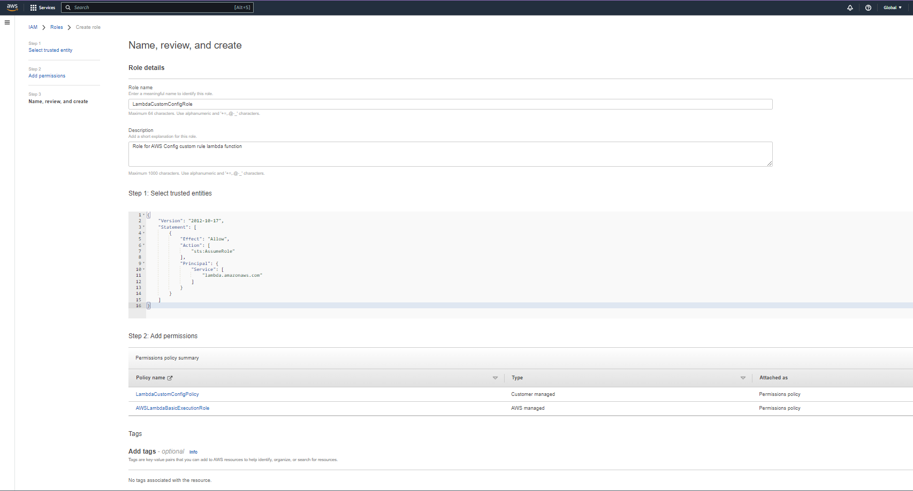
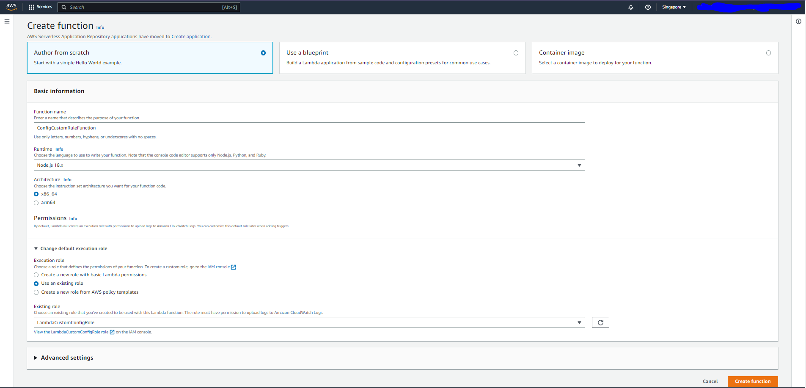
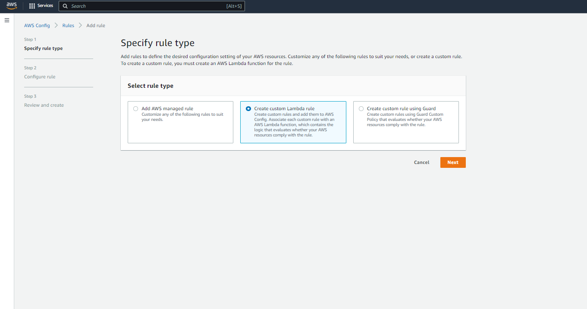
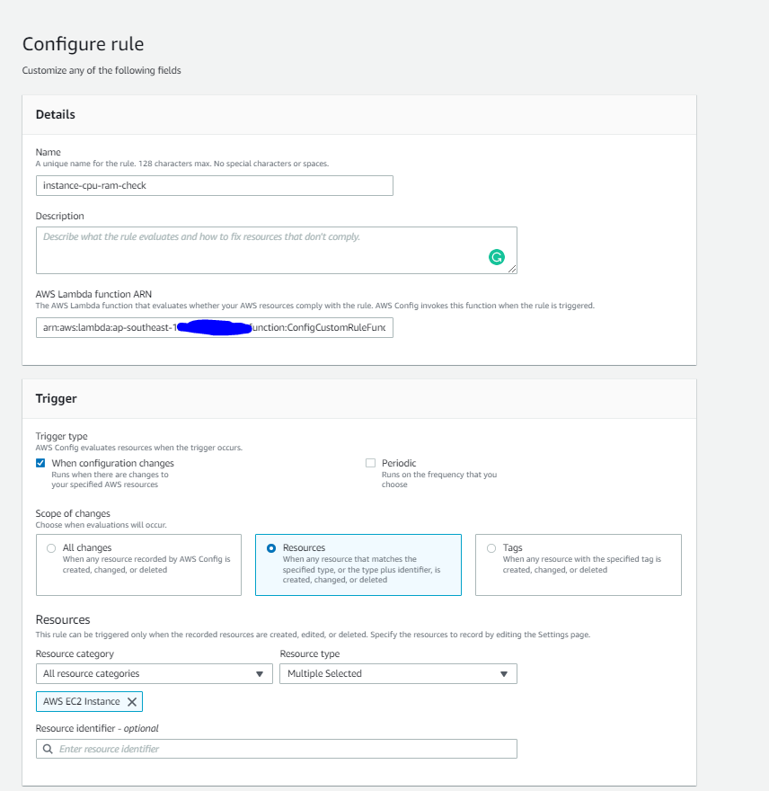
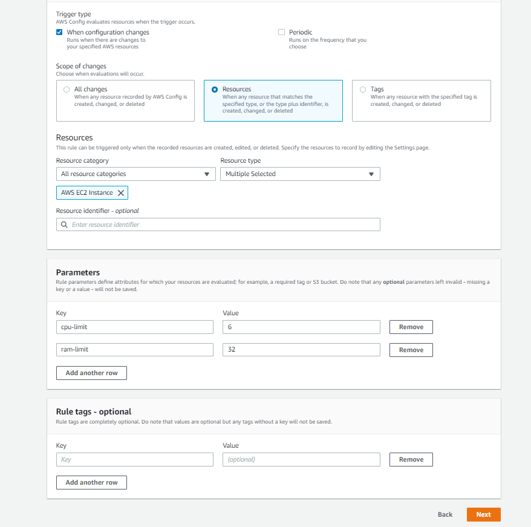
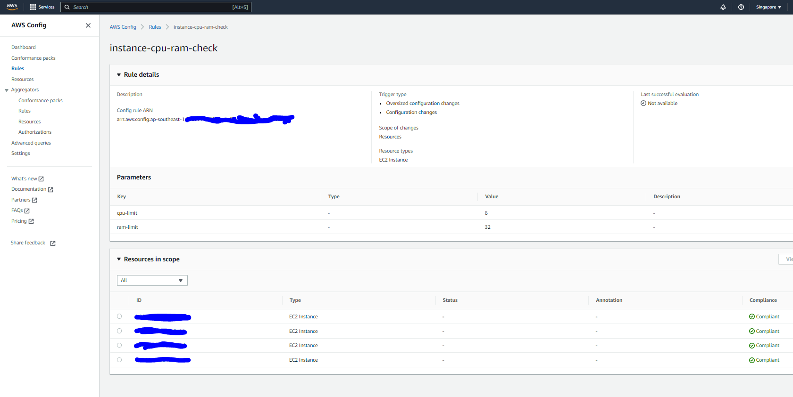
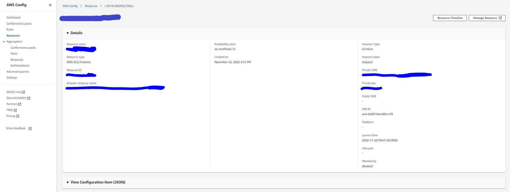
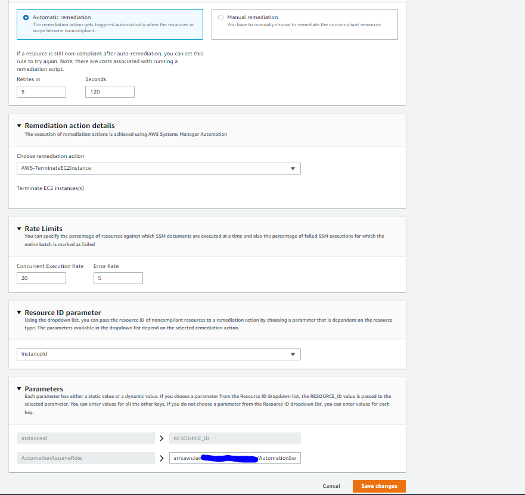
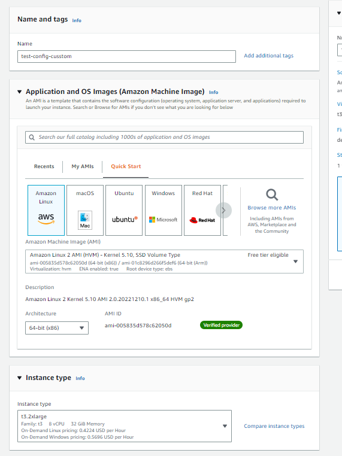

# Lab AWS Config Custom Rule

## Table of Contents
1. [Giới thiệu](#introduction)
2. [Tạo Lambda Function cho custom rule](#createlambdafunction)
3. [Tạo Custom Config rule](#createconfigrule)
4. [Test Custom rule](#testcustomrule)
4. [Cấu hình remediation cho custom rule](#configremediation)
4. [Test remediation](#testremediation)


## Giới thiệu <a name="introduction"></a>
AWS Config là managed service cho phép cloud admin dễ dàng xem xét, kiểm tra và đánh giá cấu hình các tài nguyên trên AWS. Config liên tục đánh giá cấu hình các tài nguyên AWS thông qua AWS Config rule. Các rule này so sánh cấu hình của tài nguyên với một cấu hình lý tưởng người vận hành cloud có thể cấu hình.

AWS Config bản thân có chứa rất nhiều rule có sẵn do AWS tạo sẵn và quản lý theo các best practice thông thường. Nhưng đôi khi các rule này chưa thể đáp ứng một trường hợp, cấu hình cụ thể người vận hành cloud muốn sử dụng. Trong trường hợp đó AWS Config cho cloud admin tạo AWS Config custom rules.

Trong bài lab này, ta đưa ra trường hợp giả định: Một kẻ xấu lấy cắp được credential của admin cho phép run các ec2 instances, kẻ xấu này thường tạo rất nhiều instance ngoại cỡ để sử dụng vào đào bitcoin, botnet... Ta tạo ra một aws config custom lambda rule đánh dấu các ec2 instance có số cpu hoặc ram size vượt quá một giới hạn là không tuân thủ và terminate các instance đó


## Tạo Lambda Function cho custom rule <a id="createlambdafunction"></a>

### 1. Tạo role cho Lambda function
Mở [IAM Console](https://us-east-1.console.aws.amazon.com/iamv2/home#/home) và tạo role `LambdaCustomConfigRole` gồm có các policy:

- Managed Policy `AWSLambdaBasicExecutionRole` cho phép Lambda ghi log vào CloudWatch Logs
- Policy `LambdaCustomConfigPolicy` cho phép function này đọc cấu hình instance và gửi đánh giá cấu hình về AWS Config

```json
{
  "Version": "2012-10-17",
  "Statement": {
    "Effect": "Allow",
    "Action": [
      "ec2:DescribeInstanceTypes",
      "config:PutEvaluations",
      "config:GetResourceConfigHistory"
    ],
    "Resource": "*"
  }
}
```



### 2. Tạo Lambda function

- Mở [Lambda Console](https://ap-southeast-1.console.aws.amazon.com/lambda/home?region=ap-southeast-1#/functions) và tạo Lambda Function với các settings:
  - Name: ConfigCustomRuleFunction
  - Runtime: Node.js 18.x.
  - Role: LambdaCustomConfigRole



Cấu hình environment variables REGION cho function, đặt value là region triển khai AWS Config

### 3. Tải code lên Lambda
Clone function code từ github repo `cmc-org/aws-config-custom-rule-lambda`

```bash
git clone https://github.com/cmc-org/aws-config-custom-rule-lambda.git
```

Vào thư mục `lambda-custom-config`, build function sử dụng nodejs zip và upload function code lên aws lambda

```bash
cd lambda-custom-config
npm install
zip -r function.zip .
aws lambda update-function-code --function-name ConfigCustomRuleFunction --zip-file fileb://function.zip
```


Function code xử lý event từ AWS Config:
<details>
  <summary>Click đẻ xem function code</summary>

```javascript
import convertpro from 'convert-pro';
import {ConfigServiceClient, PutEvaluationsCommand, GetResourceConfigHistoryCommand} from '@aws-sdk/client-config-service';
import {EC2Client, DescribeInstanceTypesCommand} from '@aws-sdk/client-ec2';

const configServiceClient = new ConfigServiceClient({region: process.env.REGION});
const ec2Client = new EC2Client({region: 'us-east-1'});
const convert = convertpro.default;

const COMPLIANCE_STATES = {
  COMPLIANT : 'COMPLIANT',
  NON_COMPLIANT : 'NON_COMPLIANT',
  NOT_APPLICABLE : 'NOT_APPLICABLE'
};

export async function handler(event, context){
  checkDefined( 'event', event);

  checkDefined( 'invokingEvent', event.invokingEvent);
  const invokingEvent = JSON.parse(event.invokingEvent);
  
  const configurationItem = await getConfigurationItem(invokingEvent);

  await evaluateCompliance(configurationItem, event);
}

async function getConfigurationItem(invokingEvent){
  checkDefined('mesageType', invokingEvent.messageType);
  if (invokingEvent.messageType == "OversizedConfigurationItemChangeNotification") {
    const configurationItemSummary = checkDefined('configurationItemSummary', invokingEvent.configurationItemSummary);

    const getResourceConfigHistoryCommandInput = {
      limit: 1,
      laterTime: new Date(configurationItemSummary.configurationItemCaptureTime),
      resourceType: configurationItemSummary.resourceType,
      resourceId: configurationItemSummary.resourceId
    };

    console.log(getResourceConfigHistoryCommandInput);


    const getResourceConfigHistoryCommand = new GetResourceConfigHistoryCommand(getResourceConfigHistoryCommandInput);
    const configurationItemHistory = await configServiceClient.send(getResourceConfigHistoryCommand);

    checkDefined('configurationItemHistory.configurationItems', configurationItemHistory.configurationItems);

    return convertHistoryResult(configurationItemHistory.configurationItems[0]);

  } else {
    return checkDefined('configurationItem', invokingEvent.configurationItem);
  }
}

//convert item history api call result to normal event 
function convertHistoryResult(configurationItemHistory){
  const configurationItem = {
    ...configurationItemHistory,
    ARN: configurationItemHistory.arn,
    awsAccountId: configurationItemHistory.accountId,
    configurationStateMd5Hash: configurationItemHistory.configurationItemMD5Hash,
    configuration: JSON.parse(configurationItemHistory.configuration),
    configurationItemVersion: configurationItemHistory.version,
  };

  if ({}.hasOwnProperty.call(configurationItemHistory, 'relationships')) {

    configurationItem.relationships = configurationItemHistory.relationships.map(x => { 
        return {
        ...x,
        name: x.relationshipName
      }
    });
  }

  return configurationItem;
}

async function evaluateCompliance(configurationItem, event){
  let complicance = COMPLIANCE_STATES.NOT_APPLICABLE;
  const eventLeftScope = checkDefined('eventLeftScope', event.eventLeftScope);

  if(isApplicable(configurationItem, eventLeftScope)){

    complicance = COMPLIANCE_STATES.COMPLIANT;

    checkDefined( 'ruleParameters', event.ruleParameters);
    const ruleParameters = JSON.parse(event.ruleParameters);

    const cpuLimit = Number(checkDefined('cpu-limit', ruleParameters["cpu-limit"]));
    const ramLimit = Number(checkDefined('ram-limit', ruleParameters["ram-limit"]));

    const describeInstanceTypesCommandInput = {
      InstanceTypes: [checkDefined('instanceType', configurationItem.configuration.instanceType)]
    }

    const describeInstanceTypesCommand = new DescribeInstanceTypesCommand(describeInstanceTypesCommandInput);
    const instanceTypesDescriptions = await ec2Client.send(describeInstanceTypesCommand);

    checkDefined('instanceTypesDescriptions.InstanceTypes' ,instanceTypesDescriptions.InstanceTypes)
    const description = instanceTypesDescriptions.InstanceTypes[0];

    const instanceVCpus = Number(checkDefined('DefaultVCpus', description.VCpuInfo.DefaultVCpus));

    const instanceRamInGiB = convert.bytes([description.MemoryInfo.SizeInMiB, "MiB"], "GiB");

    if (instanceVCpus > cpuLimit || instanceRamInGiB > ramLimit ){
      complicance = COMPLIANCE_STATES.NON_COMPLIANT;
    }
  }

  const putEvaluationsCommandInput = {
    ResultToken: event.resultToken,
    Evaluations: [{
      ComplianceResourceId: configurationItem.resourceId,
      ComplianceResourceType: configurationItem.resourceType,
      ComplianceType: complicance,
      OrderingTimestamp: new Date(configurationItem.configurationItemCaptureTime)
    }]  
  };

  const putEvaluationsCommand = new PutEvaluationsCommand(putEvaluationsCommandInput);

  await configServiceClient.send(putEvaluationsCommand);
}

//check if the item is deleted
function isApplicable(configurationItem, eventLeftScope) {
  checkDefined(configurationItem, 'configurationItem');
  const status = configurationItem.configurationItemStatus;
  return (status === 'OK' || status === 'ResourceDiscovered') && eventLeftScope === false;
}

function checkDefined(refName ,ref){
  if (typeof ref === "boolean") {
    return ref;
  }

  if(!ref) {
    throw new Error(`Error: ${refName} is not defined`);
  }

  return ref;
}
```
</details>


Function thực hiện các bước sau khi chạy:
  1. function chạy khi aws config gọi function và truyền event vào function handler (có thể xem sample event ở [aws documentation](https://docs.aws.amazon.com/config/latest/developerguide/evaluate-config_develop-rules_nodejs-sample.html))
  2. function kiểm tra `messageType` của event là configuration item hay oversized configuration item.
  3. Nếu là configuration item thì function giữ nguyên format. Nếu là oversized configuration item thì function lấy dữ liệu configuration từ config api `ResourceConfigHistory`
  4. function handler gọi function `isApplicable` check xem resource đã bị delete hay không
  5. function lấy thông tin instance type và check xem cpu hoặc ram có vượt quá cấu hình đã định. Nếu vượt quá function gửi kết quả là `NON_COMPLIANT` về AWS Config sử dụng lời gọi API `PutEvaluations` và ngược lại gửi `COMPLIANT` nếu instance không vượt quá limit

## Tạo Custom Config rule <a id="createconfigrule"></a>
- Vào cửa sổ [AWS Config](https://ap-southeast-1.console.aws.amazon.com/config/home?region=ap-southeast-1#/dashboard) và chọn `Add rule`
- Trong cửa sổ hiện ra, chọn `Create custom Lambda rule`



- Trong cửa sổ cấu hình rule, tại trường AWS Lambda function ARN ta điền ARN của lambda function đã tạo ở trên. Tại phần Trigger chọn trigger type là `When configuration changes` và chọn resource type là AWS EC2 Instance



- Tại phần cấu hình Parameters, set limit `cpu-limit` và `ram-limit` là số cpu hoặc ram không muốn instance vượt quá



- Tại `Review and create` bấm `Add rule`

## Test Custom rule <a id="testcustomrule"></a>
Vào giao diện chi tiết rule vừa tạo, bấm vào `Action`, chọn `Re-evaluate`, tại Resrouces in scope ta có thể thấy danh sách các EC2 instance có instance type không vượt quá limit






Bây giờ ta thử tạo một instance có instance type vượt quá limit, ở đây ta tạo một instance sử dụng instance type `c6g.2xlarge` với 8 cpu và 16 gb ram. Rule báo instance này là Noncompliant


## Cấu hình remediation cho custom rule <a id="configremediation"></a>

Đầu tiên nếu chưa set up role cho automation, ta cần tạo role cho automation sử dụng Cloudformation hoặc manual. Làm theo hướng dẫn tại [Tạo service role cho automation với Cloudformation](https://docs.aws.amazon.com/systems-manager/latest/userguide/automation-setup-cloudformation.html) để tạo service role cho AWS SSM Automation


Sau khi đã tạo xong custom rule và phát hiện được các instance vượt quá limit, ta tạo remediation tự động terminate các instance này sử dụng dịch vụ AWS SSM Automation

- Vào giao diện chi tiết rule vừa tạo, bấm vào `Action`, chọn `Manage remediation`.
- Trong cửa sổ manage remediation, chọn các cấu hình:
  - Select remediation method: Automatic remediation
  - Resource ID parameter: InstanceId
  - Parameters: tại AutomationAssumeRole điền ARN của automation service role tạo ở trên



## Test remediation <a id="testremediation"></a>
Tạo tạo một instance vượt quá limit, ở đây sử dụng instance type t3.2xlarge với 8vcpu và 32gib ram



Sau một thời gian ngắn instance này sẽ được dịch vụ AWS config asset là non-compliant resources


AWS custom rule vừa tạo sẽ trigger ssm automation remediation AWS-TerminateEC2Instance


Vào giao diện danh sách các instance, ta thấy trạng thái instance trở thành terminated


